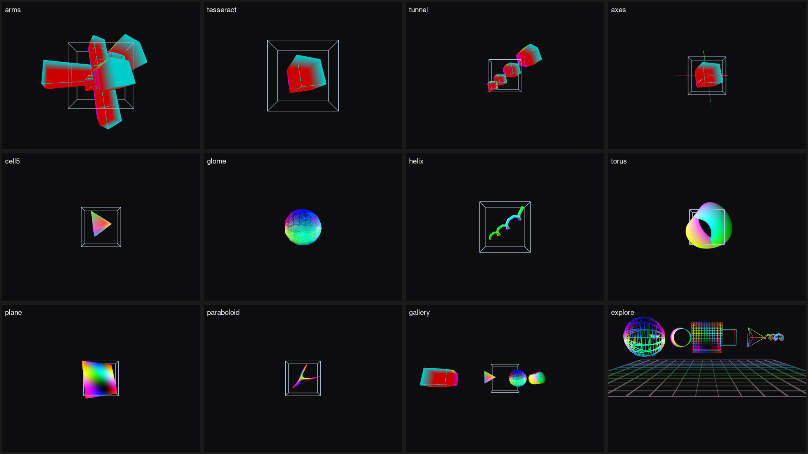
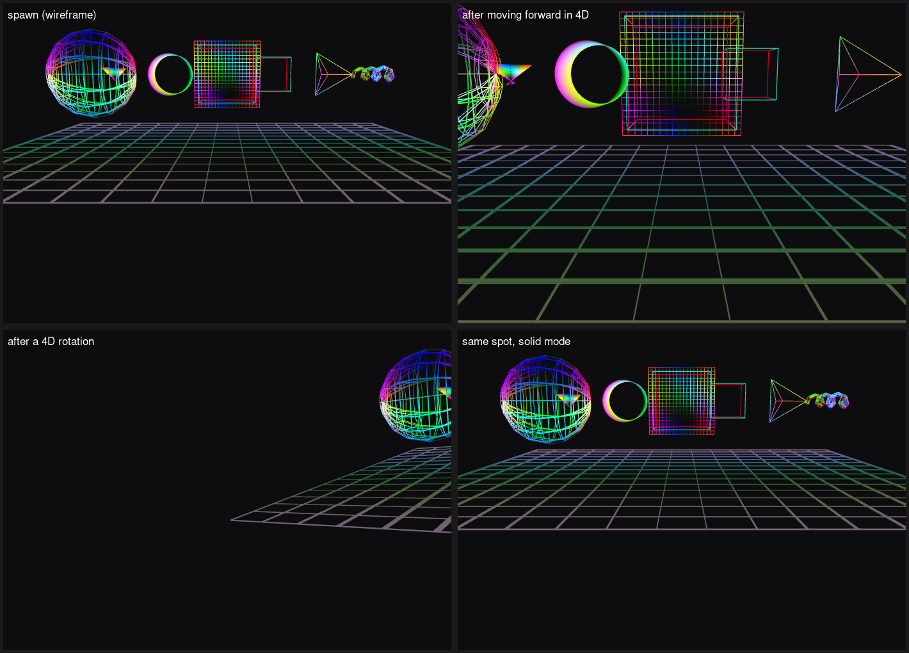
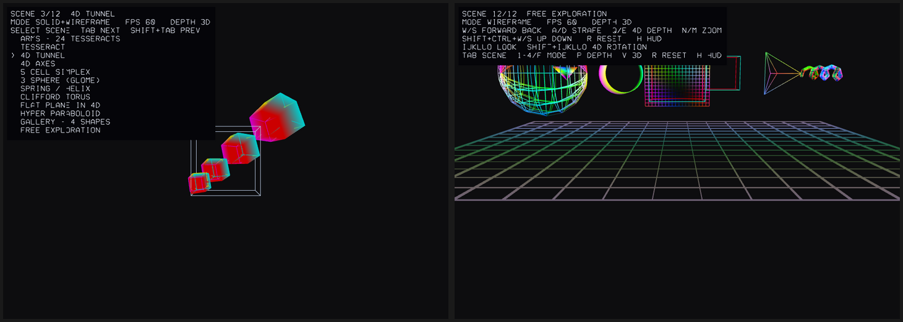
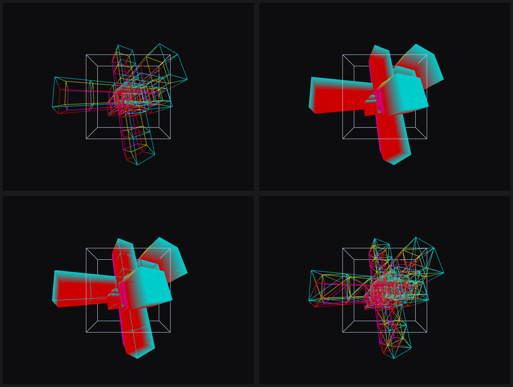
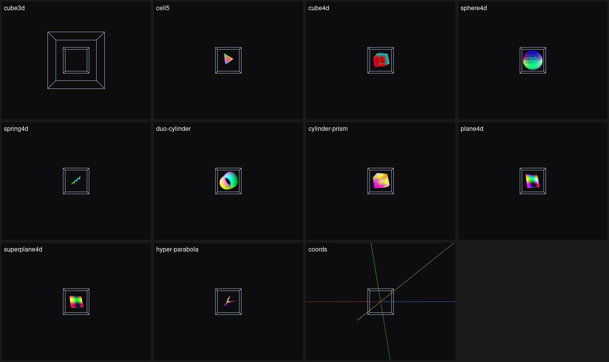

# 4D_camera
Render a 4D object to 3D just like using a 4D camera

This project is inspired by: [yugu233](http://yugu233.com/) and his project [4D](https://github.com/Crispher/4D). I think it's interesting and want to build a cpp/openGL version of it instead of typejs/three.js.

Some of the codes taken from [tendo518](https://github.com/tendo518) and [learnopengl](https://learnopengl.com/)

### Compile

dependencies:

```
cmake
libglfw3-dev
libglew-dev
libglm-dev
libfmt-dev
libeigen3-dev
```

then run `bash ./build.sh` to build & run. The build defaults to `Release`
(`-O3` + `-march=native`); an unoptimized build is several times slower.

Command line options:

```
./build/4DCam --help               # all options and keys
./build/4DCam --list-scenes        # the available scenes
./build/4DCam --scene tunnel       # start on a scene (default: arms)
./build/4DCam --mode solid         # start in a given render mode
./build/4DCam --shape spring4d     # a single shape instead of a scene
./build/4DCam --fps 60             # frame limit, 0 = unlimited
./build/4DCam --depth4d            # order by the 4D distance instead of the 3D depth
```

### Scenes

`TAB` and `SHIFT+TAB` switch between the built in scenes; each one is a small
world with its own framing (4D camera distance and angles). The list is also
printed by `--list-scenes`.



| scene | what it shows |
| --- | --- |
| `arms` | 24 tesseracts, six along each of the four 4D axes |
| `tesseract` | a single 4D cube |
| `tunnel` | four tesseracts spread along the 4th axis |
| `axes` | the 4D coordinate cross with a small tesseract |
| `cell5` | the 5 cell (4D simplex) |
| `glome` | the 3 sphere |
| `helix` | a helix / spring surface in 4D |
| `torus` | the Clifford torus (a flat torus in 4D) |
| `plane` | a flat plane patch in 4D |
| `paraboloid` | the graph of a complex square, lifted into 4D |
| `gallery` | four different shapes side by side |
| `explore` | a walkable 4D map with landmarks (see below) |

The white box is the 3D reference layer. It is **always drawn as a wireframe**
(8 corners, 12 edges, no triangles) so it never hides the 4D objects; `V` hides
it completely.

### Free exploration

The `explore` scene is a little 4D map you fly around in. The floor is the
hyperplane `y = -2`, so the walkable space is the 3D space spanned by x, z and w
(12 x 12 x 12), and eight landmarks sit above it at different places, including
different positions along the 4th axis: some of them only show up once you move
or turn in 4D. The scene swaps the ordinary camera keys for:

| keys | action |
| --- | --- |
| `W` / `S` | forward / backward *along the 4th axis* (the 4D view direction) |
| `A` / `D` | strafe left / right |
| `Q` / `E` | move along the projected depth axis |
| `SHIFT` `CTRL` + `W` / `S` | up / down along the camera's vertical axis |
| `I` `K`, `J` `L`, `U` `O` | look around (rotations in the yz, xz and xy planes) |
| `SHIFT` + the same keys | the three rotations that involve the 4th axis (yw, xw, zw) |
| `N` / `M` | zoom |
| `R` | go back to the spawn point |

`W`/`A`/`D`/`Q`/`E`, `W`/`S` walk on the `y = 0` hyperplane: their movement
direction has its vertical component removed, so the camera stays above the floor
whatever it is looking at. `SHIFT`+`CTRL`+`W`/`S` moves along the camera's own
vertical axis instead, which is the way out of that hyperplane and completes the
4 axes of 4D space (8 directions minus the one the walker keys leave out, plus
its two).



*top left: the spawn point in wireframe (the default mode for this scene), top
right: after moving forward in 4D, bottom left: after a 4D rotation, bottom
right: the same spot in solid mode*

Both cameras are 4D perspective cameras: the projection is
`screen = f * q.xyz / (D * q.w - q.z)`, where `q` is the 4D point in camera space
and `D` is the 3D camera's eye distance (its look-at translation is scaled by the
homogeneous 4th coordinate). That is why walking forward — which changes `q.w` —
makes the world grow: the 4th coordinate is the perspective divisor, not a
coordinate that gets dropped. The free camera sets `D` very large (nearly
orthographic in 3D, so the 4D perspective dominates) and adds an explicit near
clip, because the orbiting scenes' form has no near plane and would mirror
geometry through `q.w = 0`. Geometry behind the camera is removed with a clip distance
instead of being mirrored, and the depth buffer stores the 4D distance so
occlusion stays correct. The other scenes keep the projection they were framed
for.

### Depth

By default fragments are ordered by the **projected 3D depth**, i.e. what a plain
3D renderer does with the projected scene; the 3D reference layer is ordered by
the same measure, so both layers interleave correctly.

`p` (or `--depth4d`) switches to the **real 4D distance** instead: a fragment then
wins when it is closer to the camera along the 4th axis (`q.w` in the vertex
shader). That is closer to what "in front" means in 4D, but it is not a strict
improvement: two surfaces that are almost equally far away in 4D — a surface
folding over itself, or several shapes lined up along the 4th axis — end up
competing for the same pixels, and the resulting occlusion easily looks wrong
for shapes the 3D depth resolves cleanly. Hence the 3D depth stays the default
and the overlay shows which one is active (`DEPTH 3D` / `DEPTH 4D`).

Both are produced **per fragment** in `simple.fs`. Interpolating a depth value
linearly between vertices is only exact for a single perspective projection, and
the 4D distance in particular is not affine in screen space: with a per-vertex
depth, places where two surfaces are nearly equidistant in 4D dithered the winner
pixel by pixel (a speckled band where the Clifford torus folds over itself). The
vertex shaders therefore pass the one quantity this projection interpolates
exactly (`q.w` for the orbiting scenes, `1/q.w` for the free camera), and the
fragment shader turns it into the depth — or, for the default, just passes the
rasteriser's own depth through. Writing `gl_FragDepth` also means
`glPolygonOffset` no longer applies, so the wireframe overlay uses a small depth
bias uniform instead.

### Overlay

`H` toggles the built in text overlay. It draws the current scene, the render
mode, the depth source, the frame rate, the keys of the current scene and, for a
couple of seconds after switching, the scene list. The glyphs are line segments from a small stroke font, so no font file,
texture or extra dependency is needed.



### Render modes

Every shape carries both a line list and a triangle list, so it can be drawn as
a wireframe diagram or as a solid surface:

| key | mode | what it draws |
| --- | --- | --- |
| `1` / `F` | wireframe | the shape's own line list (the grid / edges) |
| `2` | solid | triangles, opaque (shapes without triangles fall back to lines) |
| `3` | solid + wireframe | triangles with the line list drawn on top |
| `4` | triangle wireframe | the triangles themselves rendered as lines |



*top left: wireframe, top right: solid, bottom left: solid + wireframe,
bottom right: triangle wireframe*

All shapes in solid + wireframe mode (`4dcam_preview --shape <name>`; `coords`
has no triangles and therefore falls back to lines):



### Colour

Every vertex carries a colour, so no shape is flat white: surfaces are coloured
by their parameter domain (a saturated three phase wheel), the 4D axes get one
colour per axis (x red, y green, z blue, w yellow, with a dimmer negative half)
and the hypercube keeps one colour per 4D cell. The gradient is what makes the
orientation of a surface readable without any lighting. The 3D reference box
stays a neutral blue grey so it never competes with the 4D objects.

### Movement:

For moving 4D Cam: `qweasd` for rotation, `zx` for zoom in/out;

For moving 3D Cam: `ijkl` for rotation, `nm` for zoom in/out

`r` resets the cameras to the framing of the current scene, `esc` quits. `p`
switches the depth source between the projected 3D depth (default) and the real
4D distance (the overlay shows which one is active), and `--depth4d` does the same
from the command line.

### Frame rate

The loop paces itself to the refresh rate reported by the monitor, and falls
back to 120 Hz when it cannot be queried (`--fps <n>` overrides it, `0` disables
the limit). Vsync is deliberately left off: the explicit limiter keeps the frame
time stable and, unlike a blocking swap, does not freeze the window while it is
being resized under WSLg or a remote desktop.

### Demo

Here is a simple demo of a 4D Cube floating on a 2D plane, while I rotating it.


### Headless preview

For machines without a display (or just to check geometry) there is a small tool
that renders a scene offscreen through EGL and writes one image per mode:

```
cmake -S . -B build -D4DCAM_BUILD_TOOLS=ON
cmake --build build -j
./build/4dcam_preview --scene tunnel --mode all --out preview
./build/4dcam_preview --shape spring4d --mode solid --hud --out preview
./build/4dcam_preview --scene gallery --dump        # where every object ended up
./build/4dcam_preview --scene torus --mode solid --depth4d   # order by the 4D distance
```

It writes binary PPM files, convert them with `convert preview/tunnel-solid.ppm out.png`.

### Structure

```
src/
  main.cpp              window, input, frame limiter, main loop
  scene.{hpp,cpp}       the scene registry, the objects and mesh sharing
  overlay.{hpp,cpp}     stroke font + screen space text overlay
  objects/
    mesh_data.{hpp,cpp} CPU geometry (vertices + line/triangle indices) and shape factories
    object.hpp          Object<D>: a mesh plus its transform (Object3D / Object4D)
  opengl/
    mesh.{hpp,cpp}      GPU buffers (VAO/VBO/EBO), RenderMode, mesh sharing
    shader.{hpp,cpp}    shader / program wrappers, cached uniform locations
    camera3D.* camera4D.*
shaders/                simple.fs, simple3D.vs, simple4D.vs
tools/preview.cpp       optional headless renderer (EGL)
```

Notes:

* `mesh_data` is CPU side data only (no OpenGL), `ogl::Mesh` owns the GPU
  buffers. Objects built from the same `mesh_data` share one set of buffers, so
  the `arms` scene's 24 tesseracts use a single VBO/EBO/VAO instead of 24 copies.
* Uniform locations are looked up once and cached instead of calling
  `glGetUniformLocation` for every uniform of every object every frame.
* The vertex shaders only compute the 4D depth into a varying; `simple.fs` turns
  it into `gl_FragDepth` (see above).
* `plane4d`, `hyper-parabola` and `hyper-exp` no longer wrap their parameter
  domain: those maps are not periodic, so wrapping glued two opposite edges
  together and stretched a seam strip across the whole surface.

TODO:

more shapes, GUI for displaying different object, camera4D optimization.
